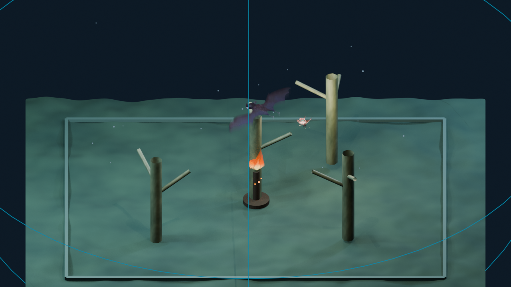
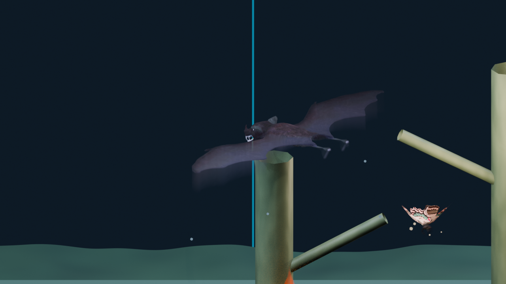

# FlyWireSim

A 3D multi-agent pursuit environment where a bat learns to catch a moth using
continuous-control reinforcement learning, biologically-inspired neural
architecture, and physically consistent sonar sensing.

**Best verified frozen-opponent result:** 39.5% catch rate on 200 held-out
hunts. A dedicated stationary-target arm reaches 22.5%, and the best
stationary-release co-evolution checkpoint reaches 26.5% on that diagnostic.






[▶ Watch the 65-second buffered Blender demo](results/flywiresim_buffered_demo_65s.gif)

## What makes this interesting

- **Custom 3D physics environment** — continuous flight, terrain, obstacles,
  boundary forces, moth flame-attraction, and randomized spawns.
- **Swept jaw collision detection** — jaw and moth paths are checked as moving
  bodies each tick; catches record the exact contact fraction and impact point.
  This found and fixed a bug where endpoint-only detection missed 35% of real
  contacts.
- **Biologically-inspired cognitive architecture** — sensory,
  proprioception, self-model, and belief specialists compete for a shared
  64-value workspace through a learned softmax gate. The recurrent state tracks
  occluded opponents. This architecture is preserved as an experimental arm.
- **Connectome-grounded escape arm** — a live bilateral LPLC2 → DNp01/Giant
  Fibre microcircuit converts angular-size expansion into 5 ms substep spike
  trains, then maps asymmetric firing to moth turn and total firing to thrust.
  This is a small causal circuit grounded in the checked-in v783 edge table,
  not a claim to simulate the entire fly brain.
- **Rigorous evaluation** — every headline result uses 200 untouched held-out
  seeds with new spawns and obstacle layouts.
- **Blender demo** — 30 consecutive unselected hunts with textured rigged
  models, sonar visualization, near-miss slow motion, and telemetry HUD.

## Results

The bat trains against a frozen moth mixture: 50% learned, 30% random, and
20% stationary. The table below uses 200 held-out seeds.

| Policy | Mixed opponents | Stationary moth |
|---|---:|---:|
| Random actions | 5.5% | 0.5% |
| Flat SAC · seed 23 · 30k steps | 17.5% | 3.5% |
| Flat SAC · seed 42 · 30k steps | 34.5% | 5.5% |
| Flat SAC · seed 7 · 30k steps | 25.5% | 6.0% |
| Flat SAC + stationary curriculum · 80k steps | **39.5%** | **22.5%** |
| Deterministic pursuit reference | 41.5% | 14.5% |
| Cognitive SAC · episode 400 | 16.0% | 0.5% |

The 39.5%/22.5% row is one frozen-moth run evaluated against the standard
50/30/20 learned/random/stationary mixture. The stationary-release
co-evolution arm is a separate experiment: both SAC policies update from the
same transition every episode, with the moth released from stationary-like
actions over its first 200 episodes. Its best 500-episode checkpoint scored
12.0% against its learned moth and 26.5% against a stationary moth. Continuing
that run to 1,000 episodes regressed to 4.5% and 6.0%, so it is documented as
an unstable research arm, not a headline result.

Three standard SAC seeds average **25.8% ± 8.5 percentage points**. The
curriculum result uses twice the training budget; its advantage reflects both
curriculum and budget. Deterministic pursuit is an omniscient reference
controller, not a theoretical upper bound.

The cognitive architecture peaked at 16% then regressed to 2%; it is preserved
and documented but not used for the demo. Connectome seeding also produced no
measurable advantage in the available comparison: 99.6% versus 99.4% moth
survival on the same 500-hunt held-out arm, a one-episode difference.

### Frozen-bat biological escape comparison

To isolate the moth-controller effect, the strongest validated bat checkpoint
(`data/validated_sac39_20260928/`) was frozen and evaluated against the same
200 held-out layouts in both arms:

| Fixed bat checkpoint | Moth controller | Catch rate |
|---|---|---:|
| Stationary-curriculum SAC | Biological LPLC2 → DNp01/GF escape circuit | 17.5% (35/200) |
| Stationary-curriculum SAC | Pure-RL moth checkpoint | 22.0% (44/200) |

Precisely: a bat trained to 39.5% catch rate against frozen opponents caught
the biological escape circuit moth on 35/200 held-out hunts, versus 44/200 for
the pure-RL moth — a 4.5 percentage-point reduction in catch rate. The
biological circuit was not trained on this environment; it uses three
connectome-verified LPLC2 → DNp01/GF synapses and produced 47.49 GF spikes per
hunt on average.

A second 200-seed holdout gave 16.0% (32/200) biological versus 22.5% (45/200)
pure-RL. Pooled across both seed ranges, the rates are 16.75% (67/400) and
22.25% (89/400). The first-run Wilson 95% intervals are approximately
12.9–23.4% and 16.8–28.2%; with this sample size, the 4.5-point gap is a
promising first comparison, not a definitive superiority claim.

The RL moth was trained against a specific bat, while the biological moth is a
fixed controller that never trained in this arena. Some of the gap may
therefore reflect bat overfitting to the RL moth's patterns and unfamiliarity
with the biological controller, rather than better biological evasion. The
exact held-out episodes and telemetry are in
[`results/biological_escape_vs_pure_rl_20260928.json`](results/biological_escape_vs_pure_rl_20260928.json).
The independent confirmation run is in
[`results/biological_escape_vs_pure_rl_confirmatory_20260928.json`](results/biological_escape_vs_pure_rl_confirmatory_20260928.json).

The biological arm was then rerun with a named 0.30-radian upward pitch target
scaled by GF activity. It reached 22.0% (44/200) and 21.0% (42/200) on the two
seed ranges, compared with the unchanged pure-RL control at 22.0% and 22.5%.
The mean commanded bias was 0.00067 radians per tick in the first run and
0.00703 radians per tick in the confirmation run, so the circuit rarely
reached the full bias. These results are recorded as an arm-specific change,
not a new headline result.

Full audit, configurations, failed hypotheses, and limitations:
[`results/repair_audit_20260927.md`](results/repair_audit_20260927.md)

## Quick start

```bash
uv sync
uv run python -m scripts.rl_tabula_rasa.test_env
uv run python -m scripts.rl_tabula_rasa.test_sac
```

Run the buffered Blender playback:

```bash
uv run python scripts/viewer.py --mode live \
  --live-stream-file data/validated_sac_demo_20260927.jsonl \
  --live-state-file data/validated_sac_demo_20260927.state.json \
  --learning-curve data/validated_sac_demo_20260927.curve.json \
  --speed 0.5 --camera chase
```

This playback contains 30 consecutive hunts: 11 catches and 19 timeouts. It
does not update the networks. The HUD identifies frozen evaluation and shows
episode state, jaw-contact outcomes, near-misses, occlusion, sonar/vision
indicators, and the learning curve. The GIF is a low-resolution 65-second
render of those same buffered frames for repository preview.

## Reproduce training

```bash
uv run python -m scripts.rl_tabula_rasa.train_sac_control \
  --steps 80000 --curriculum-steps 60000 \
  --curriculum-profile stationary --seed 23 \
  --moth-opponent-checkpoint \
    data/cognitive_swept_batched_seed23_1000ep_20260926.pt \
  --output results/my_run.json
```

Resume with the same output stem and a larger `--steps` total. The checked-in
[`data/validated_sac37_20260927/`](data/validated_sac37_20260927/) directory is
the earlier 37% mixed-curriculum checkpoint. The newer 39.5% stationary-
curriculum checkpoint is in
[`data/validated_sac39_20260928/`](data/validated_sac39_20260928/) with policy,
critics, optimizer state, replay buffer, held-out evaluation, and SHA-256
manifest. The two results use different curriculum profiles; the command
above reproduces the newer profile.

The co-evolution runner updates both policies on every shared transition and
prints an auditable `self-play: bat step N, moth step N` line for every
episode:

```bash
uv run python -m scripts.rl_tabula_rasa.train_coevolution_sac \
  --episodes 1000 --seed 23 \
  --bat-checkpoint \
    data/validated_sac37_20260927/sac_curriculum_control_seed23_20260927.zip \
  --moth-stationary-warmup 200 \
  --output results/coevolution.json
```

Evaluate the saved pair on untouched layouts with
`evaluate_coevolution_sac.py`. The generated model and replay files remain
ignored because they are large; the tracked experiment report records the
configuration and held-out outcomes.

Run the frozen-bat biological comparison:

```bash
uv run python -m scripts.rl_tabula_rasa.evaluate_biological_moth \
  --biological-bat data/validated_sac39_20260928/sac_stationary_curriculum_seed23_20260927.zip \
  --pure-rl-bat data/validated_sac39_20260928/sac_stationary_curriculum_seed23_20260927.zip \
  --pure-rl-moth data/validated_coevolution_stationary_release_20260928/coevolution_curriculum_sac_seed23_best500_20260928.moth.zip \
  --seeds 200 --seed-start 60000 \
  --output results/biological_escape_vs_pure_rl_20260928.json
```

## What is implemented

- Continuous bat control with body-frame sonar observations and SAC.
- Randomized spawn positions, seeded natural-environment obstacles, terrain,
  boundary forces, and moth attraction to a warm flame.
- Synchronous swept jaw collision with recorded contact fraction and impact
  point; jaw and moth must be within 0.16 m at the same time.
- Animated, textured bat and moth Blender assets with actual animation clips.
- Bat sonar, moth vision, flame attraction, readable decision HUD, contact dot,
  near-miss slow motion, and buffered JSONL playback.
- Recurrent four-specialist cognitive architecture with sensory,
  proprioception, self-model, and belief heads.
- FlyWire-derived connectome seeding for moth initialization, evaluated as a
  null result rather than presented as a biological advantage.
- Connectome-grounded looming escape microcircuit with bilateral LPLC2/GF
  spike-train telemetry and a matched biological-vs-pure-RL evaluation arm.

## Engineering fixes

- Replaced independent path-segment intersection with synchronous relative
  motion, eliminating false catches from paths crossing at different times.
- Applied the `dt=0.16` unit conversion consistently to bat, moth, and boundary
  dynamics; equivalence tests preserve the intended flight envelope.
- Replaced reward farming from repeated heading/thrust bonuses with discounted
  potential shaping whose terminal value is zero.
- Repaired recurrent SAC replay so critic and actor unrolls preserve episode
  history and resume restores replay, optimizers, temperature, and RNG state.

## Honest limitations and next work

- The current best mixed-opponent result comes from bat-only learning against a
  frozen moth mixture; simultaneous co-evolution is implemented but remains
  unstable after longer training.
- Stationary-target capture improved substantially but is still below the
  deterministic pursuit reference.
- Recorded FlyWire/Brian2 spikes are a prerecorded signal, not live policy
  activity.
- The new biological escape arm is a normalized, two-column LIF abstraction
  grounded by an LPLC2 → DNp01/Giant Fibre edge; its visual proxy, synaptic
  gain, motor gains, and pitch bias are engineering choices. It is not a full
  FlyWire brain simulation.
- Rendering uses visual collision proxies, not exact animated-mesh physics.

The high-effort experiments and their failed longer co-evolution continuation
are recorded in
[`results/high_effort_experiments_20260928.md`](results/high_effort_experiments_20260928.md).
The connectome null result remains in the report rather than being omitted.

## FlyWire brain tooling

```bash
uv run flywiresim --t-run 0.1 --experiment sugar
uv run python scripts/export_brain_signal.py
/Applications/Blender.app/Contents/MacOS/Blender \
  --factory-startup --python scripts/blender_world.py
```

## Credits and licenses

Built on [FlyWire/fly-brain](https://github.com/eonsystemspbc/fly-brain),
licensed GPL-2.0 like the upstream project.

- Vampire bat model: rubberduck, CC0 —
  [OpenGameArt](https://opengameart.org/content/vampire-bat-animated)
- Moth model: Amatsukast, CC BY-NC-SA 4.0 —
  [Sketchfab](https://sketchfab.com/3d-models/moth-fafcd79b60964e57a532e74706af6d16)

See [`assets/models/creatures/CREDITS.md`](assets/models/creatures/CREDITS.md)
for full attribution. The moth's non-commercial/share-alike terms apply
separately from the upstream code license.
