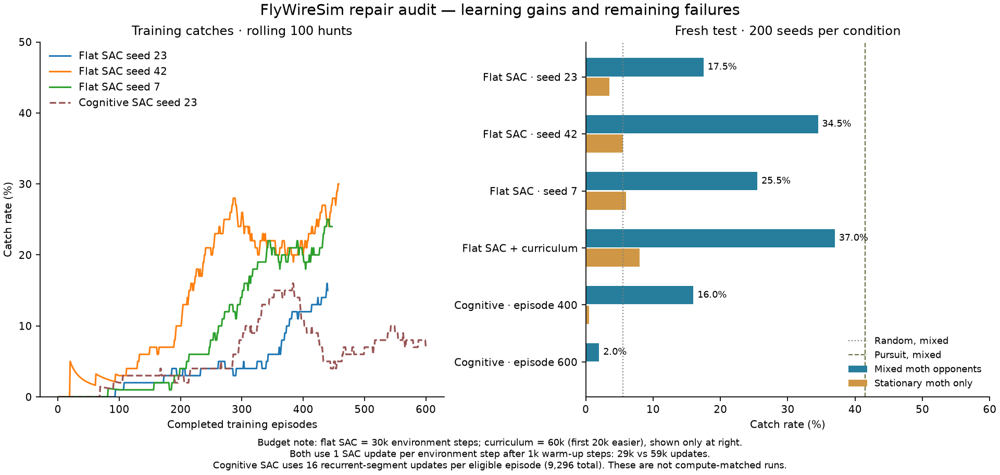

# Repair audit — 27 September 2026

## Outcome

A working **flat Stable-Baselines3 SAC training path** now beats random actions
across three training seeds. The four-specialist recurrent cognitive model is
preserved, but remains experimental: its performance regressed again. It is
not the model used in the recommended Blender demo.

All test rows below use the same 200 untouched seeds, 60000–60199, with held-out
spawns and obstacle layouts. Bat actions are deterministic; the frozen learned
moth remains stochastic. The mixed condition samples learned/random/stationary
moths with probabilities 50/30/20. These are evaluations, not training catches.

| Policy | Mixed-opponent catch rate | Stationary-moth catch rate |
|---|---:|---:|
| Random actions | 5.5% | 0.5% |
| Deterministic pursuit | 41.5% | 14.5% |
| Flat SAC, seed 23, 30k steps | 17.5% | 3.5% |
| Flat SAC, seed 42, 30k steps | 34.5% | 5.5% |
| Flat SAC, seed 7, 30k steps | 25.5% | 6.0% |
| Flat SAC, seed 23, curriculum, 60k steps | 37.0% | 8.0% |
| Cognitive SAC, saved episode 400 | 16.0% | 0.5% |
| Cognitive SAC, final episode 600 | 2.0% | 0.0% |

The three non-curriculum SAC seeds average **25.8% ± 8.5 percentage points**
(sample standard deviation across training seeds). This is evidence of learning
above the matched random baseline, not a claim that every seed is equally good.
The curriculum model has twice the step budget, so its advantage cannot be
attributed solely to curriculum. Pursuit is an omniscient reference controller,
not a theoretical upper bound.

### Training-budget comparison

The left plot uses completed episodes and includes the three standard flat SAC
runs and the cognitive run; the curriculum run appears only in the right plot.
Standard flat SAC runs collected 30,000 environment steps with 29,000 SAC
updates. The curriculum run collected 60,000 steps with 59,000 updates, including
20,000 initial easier steps. Both used one update per environment step after
1,000 warm-up steps: curriculum did **not** use a higher update frequency.
The cognitive run used 16 recurrent-segment updates per eligible episode,
9,296 total. An SAC update includes actor, critic and temperature optimization;
recurrent and flat updates process different batches and have different costs.
These are not compute-matched architecture comparisons. Historical flat episode
records lack exact step counts, so the chart does not invent per-episode gradient
coordinates. Future episode records include both counters explicitly.



## Confirmed defects and changes

- The previous alignment/thrust rewards paid +14.71 for hovering through a
  failed hunt versus +2.33 for catching the same stationary moth. Replaced them
  with discounted potential differences, terminal potential zero, and no
  recurring thrust bonus. Signed alignment supplies steering feedback while
  facing away. Rewards are sensed, not an unmasked hidden-target signal.
- Independent segment intersection counted paths crossing at different times.
  Collision now uses simultaneous relative motion and logs earliest contact.
  The historic 59.8% pursuit number is not a valid reference. The corrected
  separate flat-arena/random-moth test is 47.6% over 500 seeds.
- Completed unit conversion for both animals and boundary forces. Bat-only
  scaling mixed units. Tests verify equivalent trajectories under the full
  conversion. Arena footprint is 7 × 5.4 m, not 3.5 × 2.7 m.
- Recurrent replay now retains full episode prefixes and uses one correctly
  aligned current/next actor unroll. Independent recurrent critic encoders
  learn from Bellman error; their target encoders are softly updated too.
- Body-relative sonar vectors make left/forward/up consistent inputs without
  hardcoding steering. Frozen legacy moth velocity inputs retain their trained
  units. The cognitive actor's four heads, gate and GRU remain unchanged.
- Entropy starts at 0.005; a temperature of 0.1 with roughly two nats per tick
  could dominate the +1 terminal reward. This scaling change alone did not
  establish learning. Novelty is diagnostic-only in SAC rewards.
- Physics, reward version, input frame, temperature and checkpoints are logged.
  Incompatible cognitive resumes fail loudly. Periodic immutable snapshots
  prevent later regressions from erasing prior models.
- Blender now accepts an explicit stream and learning curve, distinguishes
  frozen-policy evaluation from live learning, and labels swept proxy contact
  accurately. The recorded FlyWire spike-visualization pipeline was not changed.
  Its camera setup is now idempotent: the old startup timer toggled the tracking
  camera off on its second call. Near-miss playback uses the recorded swept
  distance rather than inventing another collision calculation.

## Tests, counterchecks and failed hypotheses

`test_env`, `test_sac`, `test_novelty`, `test_connectome`, the cognitive module
self-check, compilation and whitespace checks passed. Added tests cover same-
time contact, different-time false intersections, static degenerate sweeps,
reward telescoping, unit equivalence, recurrent history, critic/actor gradients
and replay restoration.

An uninterrupted 21-episode cognitive run exactly matched a 20+1 resumed run:
networks, temperature, random state and replay contents were bit-identical
after 32 optimizer updates. Flat SAC resume was separately exercised from a
copied 30,000-step checkpoint to 30,001, restoring 20,000 replay transitions.
Flat SAC resumes at a new hunt; it does not promise bit-identical continuation
of a partially collected episode.

The repaired high-entropy trial was stopped at episode 240. The low-entropy
world-frame trial was stopped early; these short runs did not establish a
benefit, and do not prove that longer runs could never learn. Their results
remain saved. The body-frame cognitive run improved initially, then failed
again by episode 600. **Do not deploy that final cognitive checkpoint.**

Slowing flight in an isolated, unapplied configuration did not improve the
100-seed stationary pursuit check: 23% versus 24% with current dynamics. That
configuration was rejected; benchmark physics were not changed to raise scores.

## Run and resume

Recommended reproducible working path (flat policy, not the cognitive model):

```bash
uv run python -m scripts.rl_tabula_rasa.train_sac_control \
  --steps 60000 --curriculum-steps 20000 --seed 23 \
  --moth-opponent-checkpoint data/cognitive_swept_batched_seed23_1000ep_20260926.pt \
  --output results/my_working_run.json
# Later: same command with --resume and a larger --steps total.
```

The saved demo uses 30 consecutive new seeds: **11 catches and 19 timeouts**,
not selected successful clips. It uses the fixed training obstacle layout;
the benchmark above uses held-out layouts. Playback loops the recording and
does not update the networks.

```bash
uv run python scripts/viewer.py --mode live \
  --live-stream-file data/validated_sac_demo_20260927.jsonl \
  --live-state-file data/validated_sac_demo_20260927.state.json \
  --learning-curve data/validated_sac_demo_20260927.curve.json \
  --speed 0.5 --camera chase
```

## Not solved

Stationary-target approach and capture are still weak. The cognitive training
loop is not yet reliable. This experiment trains only the bat against a frozen
moth mixture, not simultaneous co-evolution. The prerecorded FlyWire/Brian2
spikes are not either actor's live neural activity. These results do not establish
biological realism, a connectome advantage, or learned novel tactics. Rendering
uses approximate collision proxies, not exact animated mesh physics.

All historical checkpoints and `results/benchmark.json` were preserved. No GitHub
publication or Git commit was performed. Machine-readable totals are in
`repair_audit_20260927.json`; all per-seed outcomes are retained alongside it.
